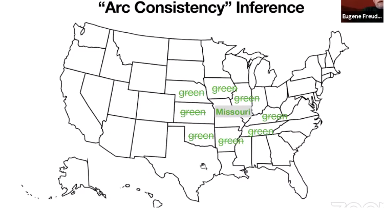
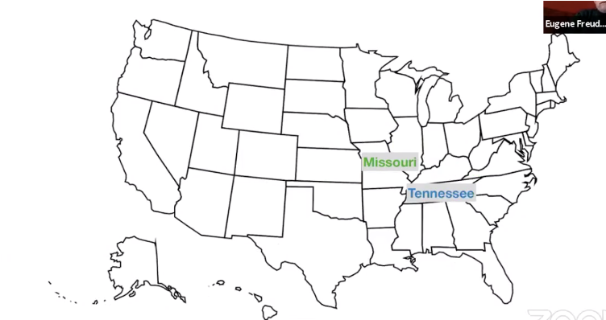
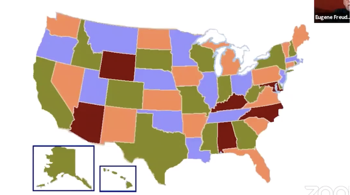
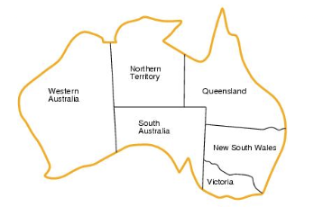

# Symbolic AI: Constraint Satisfaction
COMP 741/841 Week 5

## Agenda
- Constraint Satisfaction
- Getting started on Lab 4
- Assigned reading

## Constraint Satisfaction Problem (CSP) Example
- **Four-color map coloring theorem**
    - No more than **four colors** are required to color the regions of any map
    - Such that **no two adjancent regions** have the **same color**. 
- Map coloring problem example:
    - Color the map of the U.S.
- Map coloring problem can be represented as a CSP
    - How do we represent the US map coloring with constraints? 
- Map coloring problem solvin process: CSP search algorithm
    - What CSP algorithm solves the problem?

## Representation of a CSP
CSP is represented by 3 components:
- Set of variables
    - Example: 50 variables represent the 50 states 
- Domain of values associated with each variable
    - Example: 4 colors (e.g., green, blue, orange, magenta)
- Constraints or relationships among variables
    - Example: no two neighboring states are colored with the same color

## Solving a CSP
Assign values to variables such that all constraints are satisfided.

Algorithm: Depth-first search search combined with:
- **Variable order heuristic**
    - Choose state with fewest colors left
    - If a tie, choose state with most uncolored neighbors
- **Inference: forward checking propagation**
    - After assigning a color, propagate the value assignment by
    - Removing that color from the colors of neighboring states

## Forward Checking Propagation Example
- Pick Missouri and assign color green
- Propagate the effect: None of Missouri neighbors can be colored green

## Variable Ordering Heuristic
- Which state to choose next? 
- Rule 1: Choose the state with fewest colors left
- Rule 2: Or, break the tie and choose the state with 
the most uncolored neighbors

## US Map Coloring Solution

        
Freuder, Eugene C. 2021. “Ubiquity of Constraints.” IJCAI 2020 Research Excellence Award presented at the International Joint Conference on Artificial Intelligence, Japan, January. https://ijcai20.org/excellence-research-award-session/.

## Map Coloring Example
What is the CSP graph of Australia's Mainland states and territories? 
- Note: It does not include the state of Tasmania island

## Map Coloring CSP Graph Example

- Variables: states, represented by nodes
- Values: 3 colors (reg, green, blue)
- Constraints: binary (between two variables), not equal

## Constraint Programming (CP)
- Models problems in terms of *constraints*
- Finds *feasible* solutions from a very large set of *candidate* solutions
    - Feasible solution satisfies all the constraints
    - Candidate solution is partially feasible and **may** satisfy all the constraints.
- A CP problem is a Constraint Satisfaction Problem (CSP)
- CP solutions contain the explanation of the solution. **Why?**

## Google OR Tools Library
- Derives its name for **Operations Research (OR)** 
    - Discipline that uses math and stats to produce decisions that improve performance, subject to various constraints
        - minimize cost, OR
        - maximize efficiency
- Is used to solves CP problems
- Has TWO CP solvers
    - [CP-SAT](https://developers.google.com/optimization/cp/cp_solver) in `cp_model` module in `ortools.sat` package
    - [Original CP](https://developers.google.com/optimization/cp/original_cp_solver) in `pywrapcp`in `ortools.constraint_solver`

## CP-SAT vs CP
- CP-SAT is more efficent than CP
    - Navigates efficiently a large search space
    - Solves problems for which we don't have efficient algorithms (that have polynomial time efficiency)
    - Brute-force approaches (trying out ALL value assignment to ALL variables) would take too long to prove usable
- CP-SAT is effective for real-world problems: logistics, routing, scheduling
    - Not so much for pseudo-randomly generated problems or  or cryptographic problems

