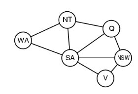

# Symbolic AI: Constraint Satisfaction
COMP 741/841 Week 5

## Agenda
- Lab 1 and 2 feedback
- Constraint Satisfaction
- Getting started on Lab 4
- Assigned reading

## Lab 1 and 2 Feedback
- ...

## Constraint Satisfaction Problem (CSP) Example
- **Map coloring problem** and the four-color map theorem
    - No more than **four colors** are required to color the regions of any map
    - Such that **no two adjancent regions** have the **same color**. 
- Example of CSP
    - Color a map of the U.S.
- CSP Represention
    - How do we represent the US map coloring with constraints? 
- CSP Search
    - What CSP algorithm solves the problem?

## Representation of a CSP
CS is represented by 3 components:
- Set of variables
    - Example: 50 variables represent the 50 states 
- Domain of values assoiated with each variable
    - Example: 4 colors (e.g., green, blue, orange, magenta)
- Constraints among variables
    - Example: no two neighboring states are colored with the same color

## Solving a CSP
Assign values to variables such that all constraints are satisfided

Algorithm: Depth-first search search combined with:
- **Variable order heuristic**
    - Choose state with fewest colors left
    - If a tie, choose state with most uncolored neighbors
- **Inference: forward checking propagation**
    - After assigning a color, propagate the value assignment by
    - Removing that color from the colors of neighboring states

## Forward Checking Propagation Example
- Pick Missouri and assign color green
- Propagate the effect: None of Missouri neighbors can be colored green

## Variable Ordering Heuristic
- Which state to choose next? 
- Rule 1: Choose the state with fewest colors left
- Rule 2: Or, break the tie and choose the state with 
the most uncolored neighbors

## US Map Coloring Solution

        
Freuder, Eugene C. 2021. “Ubiquity of Constraints.” IJCAI 2020 Research Excellence Award presented at the International Joint Conference on Artificial Intelligence, Japan, January. https://ijcai20.org/excellence-research-award-session/.

## Map Coloring Example
What is the CSP graph of Ausstralia's Mainland states and territories? 
- Note: It does not include the state of Tasmania island

## Map Coloring CSP Graph Example

- Variables: states, represented by nodes
- Values: 3 colors (reg, green, blue)
- Constraints: binary (between two variables), not equal

