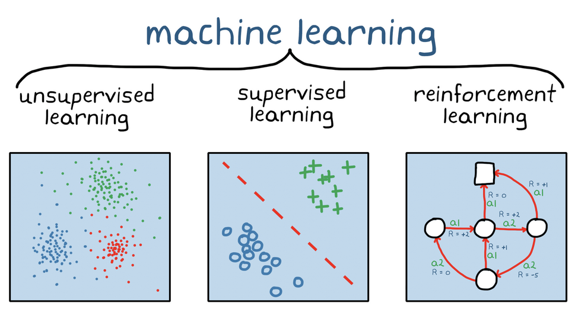
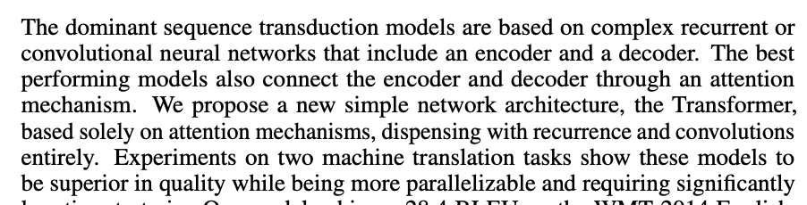
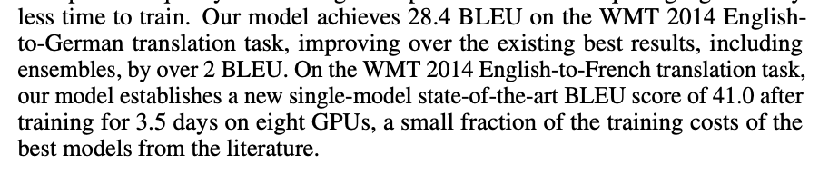

# Generative AI: Transformer Models
##$ Hugging Face NLP `pipeline()` abstraction
COMP 741/841 Week 6 - Spring 2024

## Agenda

- Writing to learn (RNs)
    - References and citations
- Lab 5: Transformers

## Reference writing style: ACM style

- Name. Year. Article title. Publication/source name. Optional: pages, URL.
    If journal/magazine: volume, number, exact date.
- Examples:
    - Henry A. Kautz, Bart Selman, and Michael Coen. 1994. Bottom-up design of software agents. Communications of the ACM 37, 7 (July 1994), 143–146. https://doi.org/10.1145/176789.
    - Adam Sadilekand Henry Kautz. 2012. Location-based reasoning about complex multi-agent behavior. Journal of Artificial Intelligence Research 43, 1 (January 2012), 87–133.

## Reference citation style: (Last name(s), Year)

- Examples:
    - (Kautz et al., 1994)
    - (Sadilekand Kautz, 2012)

## Transformer Models

- Are **language models**: trained on large amounts of text in a **_self-supervised_** way
- Solve **natural language processing (NLP)** tasks

## Machine Learning Types

Source: MathWorks. 2024. What Is Reinforcement Learning? https://www.mathworks.com/discovery/reinforcement-learning.html.

## Unsupervised Learning
- Draw inferences from the **structures** in the dataset
    - No comparision needed between **predictions** and **labels**
    - No use of any **targets** during training
    - No human intervention --> more time and cost-effective
- Methods
    - Cluster analysis
        - Discover patterns (features) in the dataset
        - Establish classes based on grouping the data
    - Feature ranking

## Self-supervised Learning
- Type of **unsupervised learning**
- Statistical understanding of the unstructured data
- Learn representations using the data itself to generate targets
- Labels are
    - Automatically generated from the input data
    - Inferred from unlabeled data
- Example: generate targets by using the next word in the sentence
- Application domains: computer vision, NLP

## Pretraining
To learn **meaningful representations of data**
- On huge amounts of data
- Initial weights are randomly chosen
- Predict parts of the input data from observed parts
- Takes significant time and computing resoruces

## Transformer Models
- Enable **transfer learning**
    - Fine-tuning in a supervised way
    - For specific practical tasks
    - On specific, labeled dataset
- Fine-tuning
    - Lss time, less data, less environmental cost
- Task examples
    - predict next word based on previous words
    - predict missing word from a sentence

Source: Hugging Face. 2023. Transformers Models: What can they do? https://huggingface.co/learn/nlp-course/chapter1/ 

## Origin of the Transformer Model
Ashish Vaswani, Noam Shazeer, Niki Parmar, Jakob Uszkoreit, Llion Jones,Aidan N. Gomez, Lukasz Kaiser, Illia Polosukhin. 2017. [Attention is all you need.](https://proceedings.neurips.cc/paper_files/paper/2017/file/3f5ee243547dee91fbd053c1c4a845aa-Paper.pdf) Proceedings of the 31st Conf. on Neural Information Processing Systems.

## Origin of the Transformer Model

## Transformer Model Architecture
Task-based architectures
- Encoder-only architecture
    - Example task: sentence classification
- Decoder-only architecture
    - Example task: text generation
- Sequence-to-sequence architecture
    - Example task: text generation based on translation or summarization

## Encoder Models
- Best for _analyzing_ text
    - What are the main topics?
    - What is the overall sentiment?
- Trained by studying _sequences_ of words
    - Has access to context to _left and right_ of current word
    - Can 'see' the whole sentence
    - Sentences create context for the model
- The more times is trained on a given sequence
    - the more likely it is to predict that sequence in the future

## Encoder Models
- Best for
    - Sentence (zero-shot) classification
    - Sentiment analysis
    - Mask-filling (fill-in-the-blank)
- Example: BERT

Source: Hugging Face. 2023. Encoder Models https://huggingface.co/learn/nlp-course/chapter1/

## Decoder Models
- Best for generating text
    - Example: chatbots, GPT-x
    - Only have access to context to the _left or right_ the current word
    - Not aware of full sentence
- Similar to encoder models: decoder models study sequences of words
- Unlike encoder models: decoder models don’t “see” the entire sentence
    - Trained iteratively word by word using context from only one direction 

Source: Hugging Face. 2023. Decoder Models https://huggingface.co/learn/nlp-course/chapter1/

## Sequence-to-sequence Models
- Best for _analyzing input and generating output_
    - Translation
    - Summarization
- Also known as encoder-decoder models
- Encoder analyzes input and passes to decoder
- Decoder is given the starting context
- Example: translation models
    - Decoder probabilistically predicts next word
    - Based on the weights for words, sentences, phrases that are passed to it by the encoder

Source: Hugging Face. 2023. Sequence-to-sequence Modelshttps://huggingface.co/learn/nlp-course/chapter1/

## Shares pretrained models and datasets
- Building a language model on pretrained weights reduces the carbon footprint
- `transformers` library function call
    - `pipeline(<task>, model=“...”)`
- Select a pretrained model
- Fine-tune for a particular NLP task

### Sentiment Analysis
- Download and cache the model to create the classifier object
- Preprocess input text so the model understands it
- Pass the input text to the model
- Model computes the predictions
- Postprocess the predictions so a human understands them.

## Lab5: Transformers
- Experiments with transformer models using Hugging Face `transformers` library
- Clone **lab5** to your SageMaker Studio Lab (SMSL) CPU instance
- Follow instructions in `README.md`
- Run through the cells, answer questions, and experiment with different input
- Solve scenarios in BUSINESS-CASES.md
- Version control your `EXPERIMENT.md` and `BUSINESS-CASES.md`
- Submit to GitHub and Canvas
