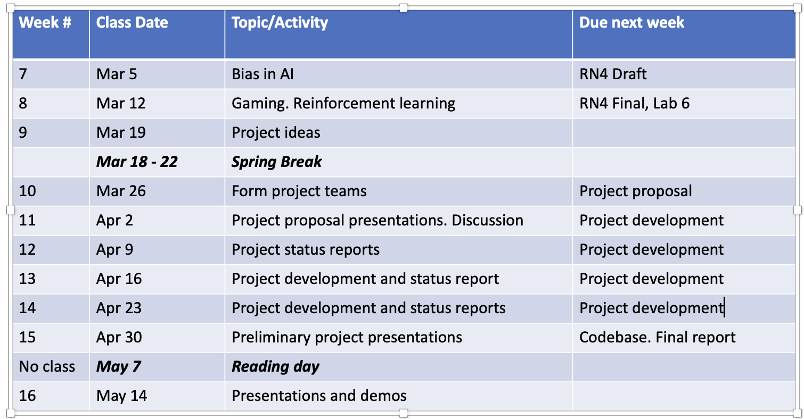

# Neural AI: Supervised Learning​
### Object Detection​

COMP 741/841 Week 7​
Fall 2023​

## Agenda​
- Presentations (15 minutes)​
- Lab 4 feedback (10 minutes)​
- Remaining course schedule (5 min)​
- Team projects (5 min)​
- Lab6 (rest of the class time)​
- Due next week (5 minutes)​

## Presentations​
**Assigned Reading​**

- Freuder, Eugene C. 2021. Ubiquity of Constraints. IJCAI 2020 Research Excellence Award presented at the International Joint Conference on Artificial Intelligence, Japan, January. [https://ijcai20.org/excellence-research-award-session/]​(https://ijcai20.org/excellence-research-award-session/)

**Presenters​**

- M1: 
- M2: 
- M3: 
- M4: 

## Lab 4 Feedback and Discussion ​
- Justification of your answer must include a **correct reference from course materials**: 6sp slides, Hugging Face NLP Tutorial​

- Justification must say **how the selected model(s)** or **selected task(s) relate to** the given scenario​

    - If you start with a general justification, make sure that you say what it means ​in the context of the given scenario​

- If you select both an encoder AND decoder, OR sequence-to-sequence model​

    - Be explicit about **which of the tasks** you are listing **​relate to the encoder** and **which of the tasks relate to the decoder​**

- The **tasks (or models) in your answer** to  the scenario **question​**

    - **must match the tasks (or models)** in  your **justification​**

- Questions?

## Remaining Course Schedule: 2nd Half

## Team Projects​
- Teams of two students will be determined by instructors during ​Week 10 (starting Oct 31)​

- Team members will have comparable levels of preparation in the course as demonstrated by work on labs​

- Teams will choose from types of projects described by the instructors​

    - Project artifacts are: ​

    - Project proposal (5%)​

    - Design document (5%)​

    - Codebase (25%)​

    - Final report (50%)​

    - Demo (15%)​

- Questions?

## Lab6: Training an Object Detection Model​
- Object detection will be broken into two labs​

    - Lab6 – training an object detection model​

    - Lab7 – evaluating an object detection model​

- Link to GitHub classroom will be provided via Discord​

- Read through the entire README.md before beginning​

    - Storage on SMSL will most likely have to be made available​

    - Detectron2 is a slightly complicated install (although worth it!)​

    - SMSL GPU instance is required to run Detectron2​

        - Lab can be started in CPU if GPU is unavailable​

## Lab6: Training an Object Detection Model​

- As you work through the notebook, complete the questions in each section​

    - Record your answers in QUESTIONS.md and commit the file to your GitHub repo​

    - No other commits will be made and/or pushed to the remote​

- QUESTIONS.md will be converted to PDF and submitted to Canvas​

## Due Next Week
**Lab6:** Complete the lab as instructed in README.md. Submit PDF of QUESTIONS.md to Canvas. ​
**RN7:** Select EITHER:​
- Augenstein, Isabelle, Karolina Stańczak, and Kristian Bjorn-Hansen. 2022. Female Politicians Disadvantaged by Online Prejudices and Stereotypes. News: Faculty of Science. University of Copenhagen. October 31, 2022. [https://science.ku.dk/english/press/news/2022/female-politicians-disadvantaged-by-online-prejudices-and-stereotypes/](https://science.ku.dk/english/press/news/2022/female-politicians-disadvantaged-by-online-prejudices-and-stereotypes/)

## Due Next Week
Or select:​

- Gordon, Rachel. 2023. Large Language Models Are Biased. Can Logic Help Save Them? MIT News | Massachusetts Institute of Technology. March 3, 2023. [https://news.mit.edu/2023/large-language-models-are-biased-can-logic-help-save-them-0303](https://news.mit.edu/2023/large-language-models-are-biased-can-logic-help-save-them-0303)

- Marcus, Gary. 2023. Elegant and Powerful New Result That Seriously Undermines Large Language Models. Substack Newsletter. Marcus on AI (blog). September 22, 2023. [https://garymarcus.substack.com/p/elegant-and-powerful-new-result-that?publication_id=888615&utm_medium=email&utm_campaign=email-share&triggerShare=true&r=ue78e](https://news.mit.edu/2023/large-language-models-are-biased-can-logic-help-save-them-0303)

## Due Next Week
Presentations​

- See **presentation-schedule.docx** in OneDrive for RN7 additional guidelines​

- Presenters: M1, M4, M3