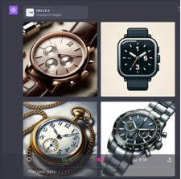
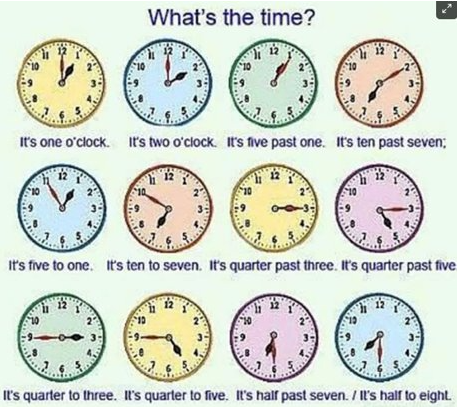

# Neural AI: Supervised Learning​
### Object Detection​

COMP 741/841 Week 7​
Fall 2023​

## Agenda​
- Remaining course schedule
- Team projects
- Bias in AI
- Assigned reading

## Remaining Course Schedule: 2nd Half

## Team Projects​
- Teams of two students will be determined by instructors during ​Week 10 (March 26)​
- Team members will have comparable levels of preparation in the course as demonstrated by work on labs​
- Teams will choose from types of projects described by the instructor
- Project artifacts are 60% of the final grade
  - Project feedback (10%): proposal, design, presentation
  - Codebase (10%)​
  - Final report (25%)​
  - Final presentation and demo (15%)​

## Is DALL-E Biased? ​

**DALL-E 3 prompt**: Images of a watch showing 1 o'clock​

**DALL-E 3 output**

**Question**: Why DALL-E generated images show 10:10? ​

  
## Is DALL-E Biased? ​

**Answer**​

  The system blindly follows the data.
  

*Source*: Gary Marcus. 2023. Race, statistics, and the persistent cognitive limitations of DALL-E. Substack: Marcus on AI.  
https://garymarcus.substack.com/p/race-statistics-and-the-persistent

## Is DALL-E Biased? 

- ​Will data points like these might have helped? ​

- Or will these data points be considered **statistical noise**? ​

## Is DALL-E Biased? 

Statistical noise definition: ​

- Unexplained variability within a data sample​
- Obscures meaningful data​

## Bias Examples: Photography​
- Photo classifiers and people of color​
  - Google Photo app, 2015​
  - Google Photo app, 2023. See Grant and Hill (2023) article in New York Times.​
- How did it happen? Bias in photography​:
  - In front of the camera​
    - Who have been photographed? What photos are widely available?​
  - Behind the camera​: Kodak's "Shirley Card"​

## Bias Examples: Photography​
How to fix it? ​
  - Better classifiers depend on more data​
  - However, more data expose representation relative to what the society has promoted​

**References​**

Grant, Nico and Kashmir Hill. 2023. Google’s Photo App Still Can’t Find Gorillas. And Neither Can Apple’s. The New York Times, 2023, sec. Technology. https://www.nytimes.com/2023/05/22/technology/ai-photo-labels-google-apple.html.​

​
Source: Brian Christian. 2020. The Alignment Problem: Machine Learning and Human Values. W. W. Norton and Company.​

## Bias Examples: Facial Image Datasets​
Labeled Faces in the Wild (LFW) dataset​
- Assembled in 2007 from online news at UMass Amherst​
- In 2014: 77% male, 83% white​

IJB-A dataset (https://paperswithcode.com/dataset/ijb-a) 
- Has facial images with wide variation in pose, illumination, resolution, occlusion​
- 5,612 images, 2,085 videos, 500 identities, 11.4 images and 4.2 videos per identity

## Bias Examples: Facial Image Datasets​
Joy Buolamwini and Timnit Gebru Analysis, 2017-2018​
- They analyzed IJB-A dataset
- Finding: Overrepresentation of light-skin images (80%) and male images (75%)​
- Finding: Underrepresentation of dark-skinned females (4.4%)​
- Built a more representative dataset using the "parliament method"​
  - Select 6 nations' parliaments: 3 from Africa and 3 from Scandinavian countries, to have roughly equal proportions of all six skin-tone categories​

## Bias Examples: Facial Image Datasets​
Joy Buolamwini and Timnit Gebru Analysis, 2017-2018​
- Tested the dataset on 3 other systems from Microsoft, IBM, and Megvii (China)​
- Finding: Classification by gender: ​
  - 90% accuracy, ... But 
  - 10%-20% more accurate for male faces than female faces
  - 10%-20% more accurate for lighter faces than darker faces​
- Finding: Intersectionality analysis by gender AND skin color: dramatically worse accuracy​
  - Both female and dark skin: 35% error rate​
  - But 0.3% error rate for male light skin​

*Source*: Brian Christian. 2020. The Alignment Problem: Machine Learning and Human Values. W. W. Norton and Company. ​

## Bias in Psychology, Sociology, Behavioral Economics​
**Definition**: Judgment) of the characteristics of a person or social group​
- Based on race, gender, class, language, religion, geography, nationality, education, occupation, disability, political affiliation, social status, music tastes, …

Many names and forms of biases​
  - **Unconscious** (or implicit) bias: without conscious awareness​
  - **Stereotype**: associate a person or group with a **consistent** set of traits​

## Bias in Psychology, Sociology, Behavioral Economics​
**Prejudice** (relates to **categorical thinking**): Tendency to *categorize* people or objects based on prior experience to make predictions about things/people in that category​
- Usually, prejudice is a negative affect towards members of a group​
- However, the process of categorization and prediction is necessary for​:
  - Normal interaction and survival​
- Examples: know how to conduct with friends vs strangers; find items in a grocery store; ...​

## Bias in Empirical Research​
Empirical research of a phenomenon means:​ Collect and analyze empirical evidence from quantitative and/or qualitative data​
- Where does the bias come from? Some examples:​
- Data sample: **sampling bias**
  - Data may not be random, or may not give equal chance for each point to belong to the dataset​
- Participants' self-reports: **self-serving bias​**
  - In survey studies, participants overemphasize desirable qualities and downplay undesirable qualities​

## Bias in Empirical Research​
- Researcher's subjectivity: **experimenter expectation bias​**
  - Researcher may influence participants in interview or focus groups studies​
*Source*: Jenny Gutbezahl. 2017. 5 Types of statistical bias to avoid in your analyses. Harvard Business School Online. https://online.hbs.edu/blog/post/types-of-statistical-bias​

## Bias in Statistics, ML, Supervised Learning
Prediction errors on *unseen data* (not used during training):​
- **Bias** errors: can cause **underfitting​**
  - Algorithm misses relevant relations between features and target ​
  - Example: Straight line fit to data that exhibit quadratic behavior overall​
- **Variance** errors: can cause **overfitting**
  - Algorithm models the *random noise* in the training data​
  - Example: Higher-order polynomial fit to data that exhibit quadratic behavior overall

## Bias in Statistics, ML, Supervised Learning
More graphical example on Wikipedia(2023)

Source: Wikipedia. 2023. Bias-Variance Tradeoff. Motivation section. https://en.wikipedia.org/wiki/Bias%E2%80%93variance_tradeoff​

## How to "Interrupt" Bias?
Better data, less bias​
- See Microsoft Research (2023) initiative to formalize and operationalize data documentation
- Good data documentation practices help developers with exposing:
    - underlying assumptions​, potential risks​, implications of use​
- Good data documentation help users of dataset​s with
    - Makeing decisions​
    - Understanding limitations​

## How to "Interrupt" Bias?
Tools
- Datasheets for data sets https://www.microsoft.com/en-us/research/publication/datasheets-for-datasets/ ​
- Aether Data Documentation ​https://www.microsoft.com/en-us/research/uploads/prod/2022/07/aether-datadoc-082522.pdf ​

*Source*: Microsoft Research. 2023. Data Documentation. https://www.microsoft.com/en-us/research/project/datasheets-for-datasets/​