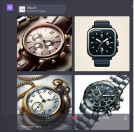
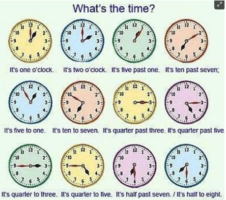
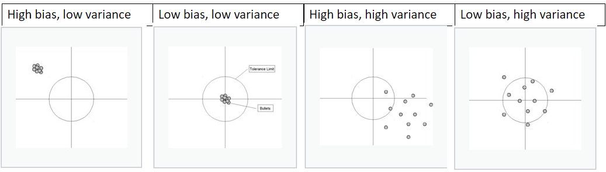

# Bias​
**Examples​**
### Discipline-specific Bias Concepts and Theories​
### Bias in Supervised Learning

COMP 741/841 Week 8​
Fall 2023

## Agenda
- Presentations (15 minutes) 
- Lab 5 feedback (10 minutes)​
- Bias ​
    - Examples​
    - Bias in various disciplines​
    - Bias in supervised learning​
- Due next week (5 minutes)

## Presentations
**Assigned Reading**: Select EITHER:​

- Augenstein, Isabelle, Karolina Stańczak, and Kristian Bjorn-Hansen. 2022. Female Politicians Disadvantaged by Online Prejudices and Stereotypes. News: Faculty of Science. University of Copenhagen. October 31, 2022. https://science.ku.dk/english/press/news/2022/female-politicians-disadvantaged-by-online-prejudices-and-stereotypes/.​

Or select:​

- Gordon, Rachel. 2023. Large Language Models Are Biased. Can Logic Help Save Them? MIT News | Massachusetts Institute of Technology. March 3, 2023. https://news.mit.edu/2023/large-language-models-are-biased-can-logic-help-save-them-0303.​

## Presentations

- Marcus, Gary. 2023. Elegant and Powerful New Result That Seriously Undermines Large Language Models. Substack Newsletter. Marcus on AI (blog). September 22, 2023. https://garymarcus.substack.com/p/elegant-and-powerful-new-result-that?publication_id=888615&utm_medium=email&utm_campaign=email-share&triggerShare=true&r=ue78e.​

**Presenters​**

M1:
M2:
M3:
M4:

## Lab 5 Feedback and Discussion
- Solution is entirely based on the Google OR CP-SAT implementation illustrated in the n-queens example​

- Incremental development is more than multiple commits​

- A large number of commits can be as unhelpful as a single commit​

    - Where to look when something goes wrong? Now have to search through large commit history​

- Don't start incremental commits after completing the problem​

    - This is incremental commits, not incremental development​

## Lab 5 Feedback and Discussion

- Ex. of incremental development​

    - Commit requirements.txt​

    - Commit n-queens NQueenSolutionPrinter​

    - Clean and commit NQueenSolutionPrinter using pylint and pycodestyle​

- Docstrings should be descriptive​

    - "solves the problem with constraint programming" is not descriptive​

- n-queens main() performs the bulk of the work – this should be reflected​

    - What constraints are required? What variables are we using? What is the expected output?​

## Lab 5 Feedback and Discussion

- If docstring becomes too long, consider refactoring the function in several​

    - A long docstring could be a sign that the function is doing more than just one thing!​

To learn more about see applying CP-SAT to implement optimization problem solutions, see:​

- Champion, Antoine. 2020. When you can use constraint solvers instead of machine learning. Medium: Towards Data Science.  https://medium.com/towards-data-science/where-you-should-drop-deep-learning-in-favor-of-constraint-solvers-eaab9f11ef45 ​

- Labonne, Maxime. 2022.  Introduction to Constraint Programming in Python. GitHub.io ML Blog https://mlabonne.github.io/blog/. https://mlabonne.github.io/blog/posts/2022-05-02-Constraint_Programming.html  ​

## Is DALL-E Biased? ​

**DALL-E 3 prompt**: Images of a watch showing 1 o'clock​

**DALL-E 3 output**

**Question**: Why DALL-E generated images show 10:10? ​

  
## Is DALL-E Biased? ​

**Answer**​

  The system blindly follows the data.
  

Source: Gary Marcus. 2023. Race, statistics, and the persistent cognitive limitations of DALL-E. Substack: Marcus on AI.  
https://garymarcus.substack.com/p/race-statistics-and-the-persistent ? ​

## Is DALL-E Biased? 

- ​Will data points like these might have helped? ​

- Or will these data points be considered **statistical noise**? ​

## Is DALL-E Biased? 

Statistical noise definition: ​

- unexplained variability within a data sample​

- Obscures meaningful data​

## Bias Examples: Photography​
- Photo classifiers and people of color​

  - Google Photo app, 2015​

  - Google Photo app, 2023. See Grant and Hill (2023) article in New York Times.​

    - Copy of the article is uploaded to OneDrive folder. ​

- How did it happen? Bias in photography​

  - In front of the camera​

    - Who have been photographed? What photos are widely available/ ​

  - Behind the camera​

    - Kodak's "Shirley Card"​

## Bias Examples: Photography​

- How to fix it? ​

  - Better classifiers depend on more data​

  - More data, however, expose representation relative to what the society has promoted​

**References​**

- Grant, Nico, and Kashmir Hill. 2023. Google’s Photo App Still Can’t Find Gorillas. And Neither Can Apple’s. The New York Times, 2023, sec. Technology. https://www.nytimes.com/2023/05/22/technology/ai-photo-labels-google-apple.html.​

​
Source: Brian Christian. 2020. The Alignment Problem: Machine Learning and Human Values. W. W. Norton and Company.​

## Bias Examples: Facial Image Datasets​
- Labeled Faces in the Wild (LFW) dataset​

  - Assembled in 2007 from online news at UMass Amherst​

  - In 2014: 77% male, 83% white​

- IJB-A dataset (https://paperswithcode.com/dataset/ijb-a) ​

  - Has facial images with wide variation in pose, illumination, resolution, occlusion​

  - 5,612 images, 2,085 videos, 500 identities, 11.4 images and 4.2 videos per identity

## Bias Examples: Facial Image Datasets​
- Joy Buolamwini and Timnit Gebru Analysis, 2017-2018​

  - They analyzed IJB-A dataset and found:​

    - Overrepresentation of light-skin images (80%) and male images (75%)​

    - Underrepresentation of dark-skinned females (4.4%)​

  - Built a more representative dataset using the "parliament method"​

    - Select 6 nations' parliaments: 3 from Africa and 3 from Scandinavian countries, to have roughly equal proportions of all six skin-tone categories​

## Bias Examples: Facial Image Datasets​
- Joy Buolamwini and Timnit Gebru Analysis, 2017-2018​

  - Tested the dataset on 3 other systems from Microsoft, IBM, and Megvii (China)​

    - Classification by gender: ​
      - 90% accuracy, but 10%-20% more accurate for male faces than female faces, 10%-20% more accurate for lighter faces than darker faces​

    - Intersectionality analysis by gender AND skin color: dramatically worse accuracy​

      - Both female and dark skin: 35% error rate​

      - But 0.3% error rate for male light skin​

Source: Brian Christian. 2020. The Alignment Problem: Machine Learning and Human Values. W. W. Norton and Company. ​

## Bias in Psychology, Sociology, Behavioral Economics​
Evaluation (judgment) of the characteristics/traits of a person or social group​

- Based on race, gender, class, language, religion, geography, nationality, education, occupation, disability, political affiliation, social status, music tastes, …

Many names and forms of biases​
  - **Unconscious** (or implicit) bias: without conscious awareness​

  - **Stereotype**: associate a person or group with a **consistent** set of traits​

## Bias in Psychology, Sociology, Behavioral Economics​
  - **Prejudice** (relates to **categorical thinking**)​
    - Tendency to categorize people or objects based on prior experience
      - In order to make predictions about things/people in that category​
    - Usually, prejudice is a negative affect towards members of a group​
    - However, the process of categorization and prediction is necessary for​
      - Normal interaction and survival​
      - Examples: know how to conduct with friends vs strangers; find items in a grocery store; ...​

## Bias in Empirical Research​
Empirical research of a phenomenon means:​
- Collect and analyze empirical evidence from quantitative and/or qualitative data​
Where does the bias come from? Some examples:​
- Data sample: **sampling bias**
  - Data may not be random, or may not give equal chance for each point to belong to the dataset​
- Participants' self-reports: **self-serving bias​**
  - In survey studies, participants overemphasize desirable qualities and downplay undesirable qualities​

## Bias in Empirical Research​
- Researcher's subjectivity: **experimenter expectation bias​**
  - Researcher may influence participants in interview or focus groups studies​
Source: Jenny Gutbezahl. 2017. 5 Types of statistical bias to avoid in your analyses. Harvard Business School Online. https://online.hbs.edu/blog/post/types-of-statistical-bias​

## Bias in Statistics, ML, Supervised Learning
Bias-variance tradeoff between two sources of error: **bias** and **variance**​
Prediction errors on unseen data (not used during training):​
- **Bias** error can cause **underfitting​**
  - Algorithm misses relevant relations between features and target ​
  - Example: Straight line fit to data that exhibit quadratic behavior overall​
- **Variance** error can cause **overfitting**
  - Algorithm models the random noise in the training data​
  - Example: Higher-order polynomial fit to data that exhibit quadratic behavior overall

## Bias in Statistics, ML, Supervised Learning
More graphical example on Wikipedia(2023)

Source: Wikipedia. 2023. Bias-Variance Tradeoff. Motivation section. https://en.wikipedia.org/wiki/Bias%E2%80%93variance_tradeoff​

## How to "Interrupt" Bias?
Better data, less bias​
- See Microsoft Research (2023) initiative to formalize and operationalize data documentation
- Good data documentation practices help:​
  - Developers with exposing:​
    - underlying assumptions​
    - potential risks​
    - implications of use​
  - Users of dataset​
    - Make decisions​
    - Understand limitations​

## How to "Interrupt" Bias?
- Tools:​
  - Datasheets for data sets https://www.microsoft.com/en-us/research/publication/datasheets-for-datasets/ ​
  - Aether Data Documentation ​https://www.microsoft.com/en-us/research/uploads/prod/2022/07/aether-datadoc-082522.pdf ​

Source: Microsoft Research. 2023. Data Documentation. https://www.microsoft.com/en-us/research/project/datasheets-for-datasets/​

## Due Next Week​
**Handout​**
- week8-bias-in-machine-learning.docx​

**Reading Note (RN8)**
Denning, Peter J., and Dorothy E. Denning. 2020. Dilemmas of Artificial Intelligence. Communications of the ACM 63 (3): 22–24. https://doi.org/10.1145/3379920.​

**Presentations​**
- See **presentation-schedule.docx** in OneDrive for RN7 additional guidelines​
  - Split 10 dilemmas and the conclusion between presenters ​
- Presenters: ​
  - M1:
  - M2:
  - M3:
  - M4: