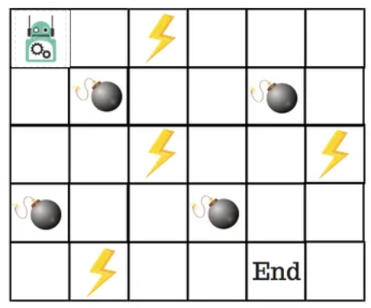
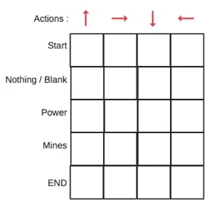
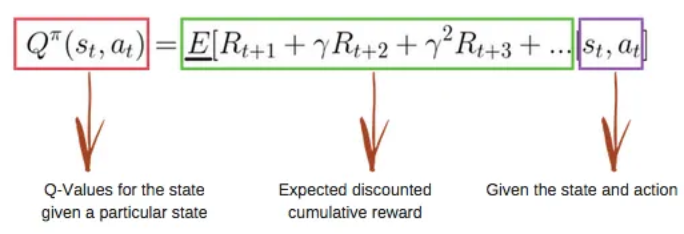
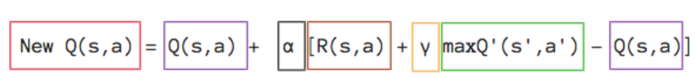
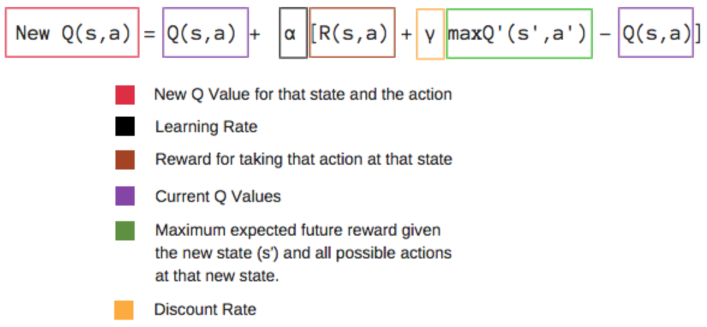

## Review and Team Projects
COMP 741/841 Week 9

Spring 2024

## Agenda
- Reinforcement learning (RL)
- Team projects

## Reinforcement Learning
- Agent, states, start/goal states, actions per state, rewards
- Agent performs action **a_t** in state **s_t**
  - To transition in the next state **s_(t+1)**
  - For which it gets a reward (numerical score)
- Agent purpose: maximize the reward

## RL: Q Function and Q Table
- Learns the value of an action in a given state
- Uses Q-function (quality of state & action combination):
- Calculates the Q values of the *maximum expected future rewards* in each state, for each action
- Records and iteratively updates the values in a **Q table**
  - Columns are the actions
  - Rows are the possible states

## RL: Q-Learning Algorithm
- Initially, Q values in the Q tables are set to an arbitrary fixed value
- At each time **t**, the agent
  - Agent selects action **a_t**
  - Agent observes the reward **R_(t+1)**
  - Agent transitions to state **S_(t+1)** (based on state **s_t**)
  - New **Q(s_t, a_t)** value updates current Q value
- Introduced by Chris Watkins in 1989

## New Q Value Calculation
New Q value uses Bellman equation, which depends on:
- Learning rate $\alpha$
- Discount factor $\gamma$
- Maximum expected future reward given the new state and ALL possible actions in the new state

## Deep Q-Learning and More
- Deep Q-Learning (DQN)
  - Google DeepMind patents Q-learning applied to deep learning (DQN) in 2014
  - Can play Atari games at expert human levels
  - Uses a deep convolutional neural network
- Other types of Q-learning
  - Double DQN, Delayed Q-learning, multi-agent (mini-max) Qlearning

## Classic Q-Learning Algorithm Example
*Source*: ADL. 2018. An Introduction to Q-Learning: Reinforcement Learning. freeCodeCamp.Org. September 3, 2018. https://www.freecodecamp.org/news/an-introduction-to-q-learning-reinforcement-learning-14ac0b4493cc/

*Problem*: Train the robot to reach the end goal with the shortest path without stepping on a mine

## Q-Table Example
- 4 actions: up, right, down, left
- 5 possible states: start, end, power, mine, nothing/blank
- Q-table score: maximum expected future reward the robot gets IF it takes the action at the state

## Reward (scoring) points
- Lose 1 point at each step to reward the shortest path and reaching the goal as fast as possible
- Lose 100 points if the robot steps on a mine
- Gain 1 point if the robot steps on power
- Gain 100 points if the robot reaches the End goal.

## Q-Function
- Belman equation

- Q-value calculation

## New Q-value Calculation

